# 预约管理系统 appointment-system

一套支持**用户预约 + 管理员后台 + 改期 + 站内提醒通知**的全栈示例项目，**uni-app + Spring Boot** 实现。

- ✅ 用户 / 管理员两级角色，BCrypt + JWT 鉴权
- ✅ 预约创建、改期、取消；冲突校验；可预约时间段
- ✅ 管理员：服务 / 员工 / 员工-服务分配 / 用户 / 仪表盘
- ✅ **CONFIRMED 预约 24 小时 / 1 小时前自动生成站内通知**
- ✅ 改期 / 取消 / 删除时联动清理通知；数据库唯一约束保证幂等
- ✅ 162 个自动化测试全绿；含 1 小时提醒端到端 H5 实测

---

## 📸 项目截图

### 用户侧

| 登录 | 注册 | 首页（未读角标） |
| :--: | :-: | :-: |
| 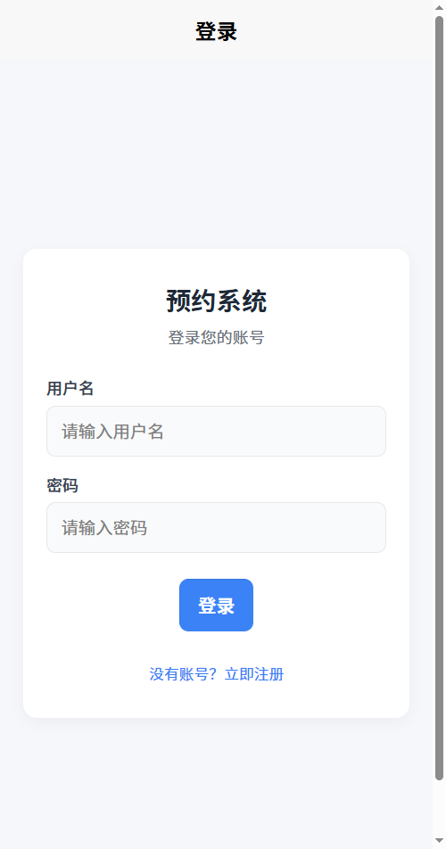 | 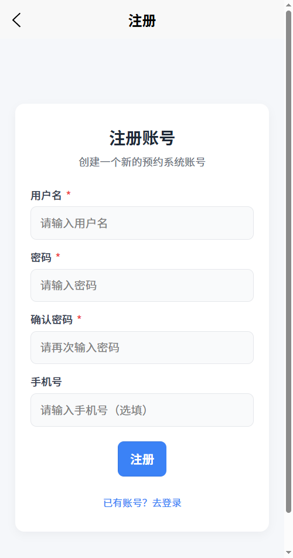 | 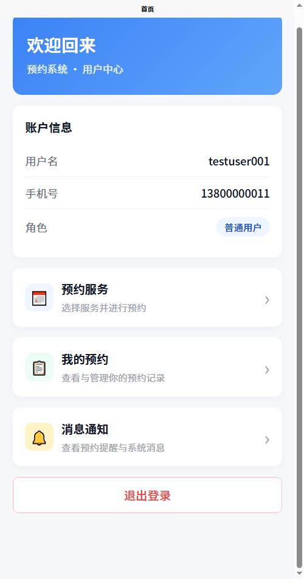 |

| 服务列表 | 工作人员列表 | 创建预约（时间段选择） |
| :--: | :-: | :-: |
| 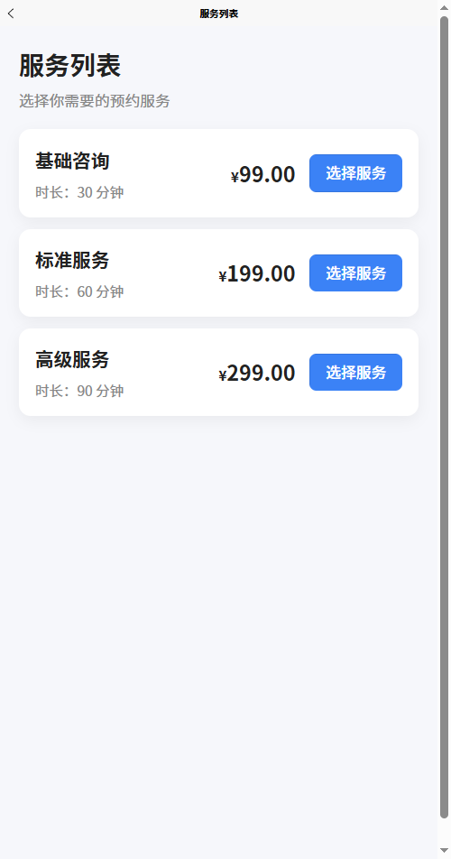 | 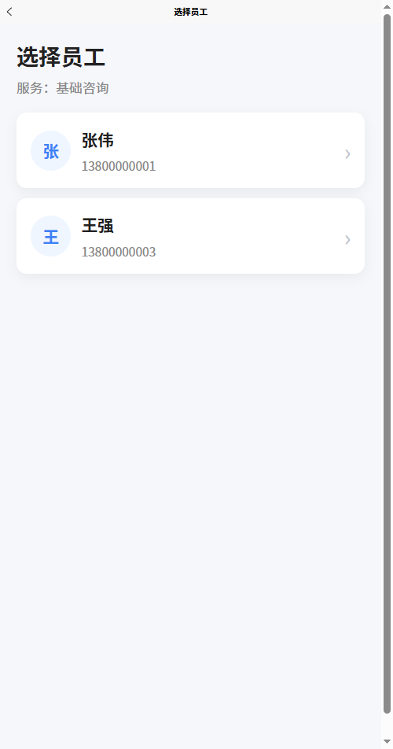 | 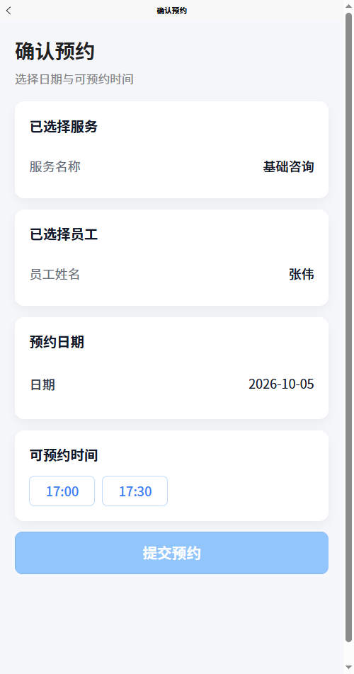 |

| 我的预约 | 预约改期 | 消息通知（v2.2） |
| :--: | :-: | :-: |
| 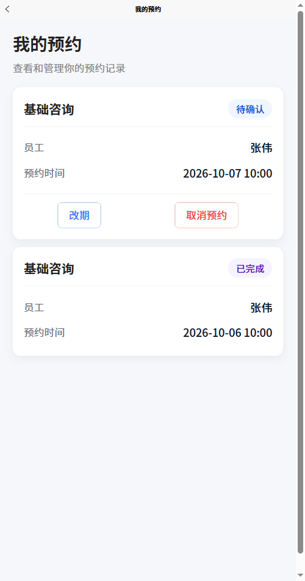 | 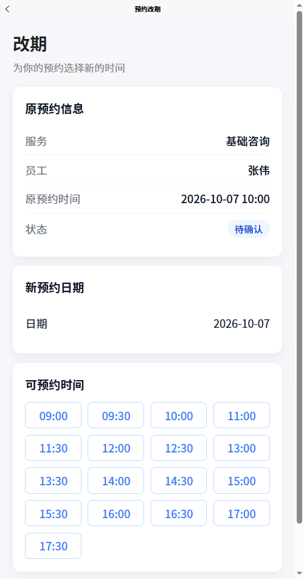 | 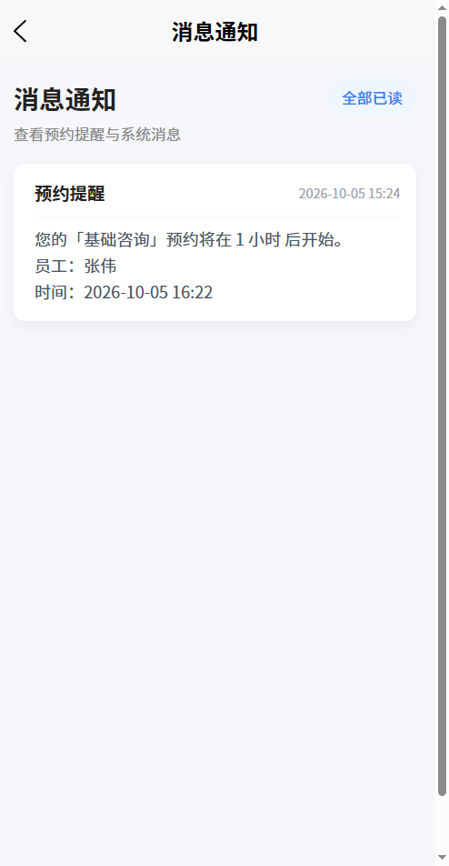 |

### 管理员侧

| 管理仪表盘 | 预约管理 | 服务管理 |
| :--: | :-: | :-: |
| 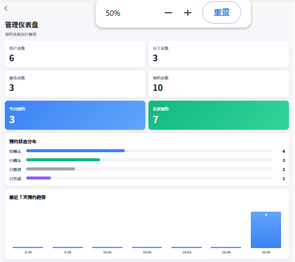 | 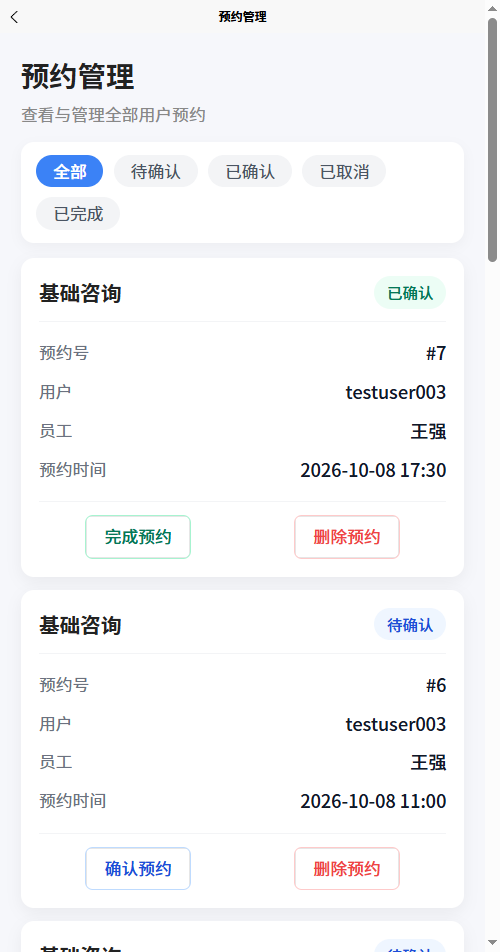 | 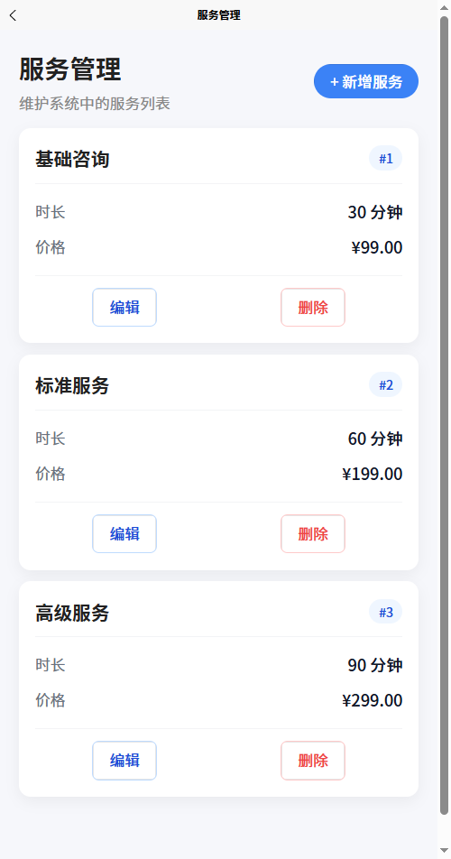 |

| 员工管理 | 员工-服务分配 | 用户管理 |
| :--: | :-: | :-: |
| 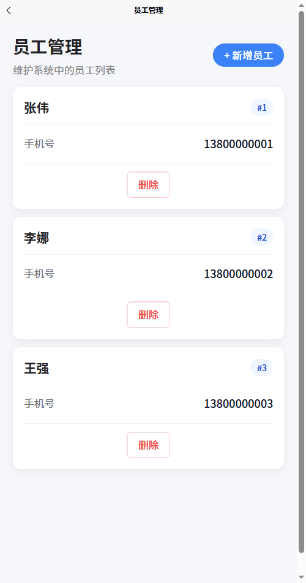 | 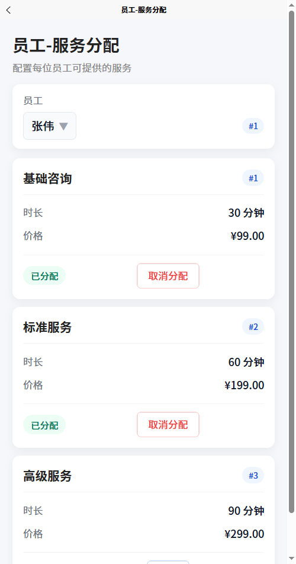 | 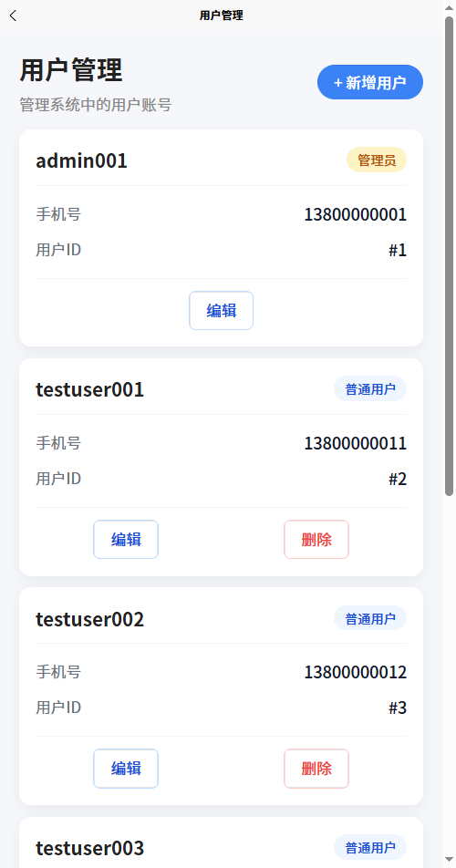 |

---

## ✨ 核心功能

### 用户端

- 用户注册 / 登录
- JWT 身份认证
- 服务浏览
- 工作人员浏览
- 创建预约（自动校验冲突、营业时间、可预约时间段）
- 查询自己的预约
- 预约取消
- 预约改期
- 消息通知（站内 / 已读 / 未读 / 全部已读）

### 管理员端

- 用户管理（增删改查）
- 服务管理（增删改查）
- 工作人员管理
- 工作人员与服务绑定管理
- 全部预约管理
- 预约确认（PENDING → CONFIRMED）
- 预约完成（CONFIRMED → COMPLETED）
- 管理仪表盘（基础数据展示）

### 通知系统（v2.2）

- 仅 `CONFIRMED` 预约进入提醒系统（PENDING / CANCELLED / COMPLETED 不触发）
- 24 小时前自动生成 `APPOINTMENT_24H` 提醒
- 1 小时前自动生成 `APPOINTMENT_1H` 提醒
- 每分钟扫描一次（`@Scheduled(cron="0 * * * * *")`）
- 站内消息列表 + 已读 / 未读管理
- 改期 / 取消 / 删除预约时联动清理通知
- 数据校验约束保证幂等不丢失

---

## 🛠 技术栈

### 后端

- **Java 17**
- **Spring Boot 4.0.8**
- Spring Data JPA
- Spring Security
- JWT（nimbus-jose-jwt 10.4）
- BCrypt 密码哈希
- MySQL
- Maven

### 前端

- **uni-app**
- **Vue 3**
- HBuilderX 5.24
- Vite
- H5

---

## 🔄 核心业务流程

### 用户预约

```
注册
  ↓
登录
  ↓
浏览服务
  ↓
选择工作人员
  ↓
选择可预约时间（available-slots）
  ↓
创建预约（状态 = PENDING）
  ↓
等待管理员确认
  ↓
查看预约
  ↓
改期 / 取消
  ↓
CONFIRMED 预约进入提醒系统
  ↓
收到站内通知（24h 前 + 1h 前）
```

### 管理员处理

```
管理员登录
  ↓
查看全部预约
  ↓
确认预约（PENDING → CONFIRMED）
  ↓
完成预约（CONFIRMED → COMPLETED）
```

---

## 📅 预约状态

| 状态          | 含义          |  提醒 |  改期 |  取消 |
| ----------- | ----------- | :-: | :-: | :-: |
| `PENDING`   | 已创建，等待管理员确认 |  ❌  |  ✅  |  ✅  |
| `CONFIRMED` | 管理员已确认      |  ✅  |  ✅  |  ✅  |
| `CANCELLED` | 已取消         |  ❌  |  ❌  |  —  |
| `COMPLETED` | 已完成         |  ❌  |  ❌  |  ❌  |

---

## ⏰ 时间与预约规则

- 预约时间不能早于当前时间
- 营业时间 **09:00 – 18:00**
- 预约结束时间不能超过 18:00
- 同一工作人员时间冲突会被拒绝
- 相邻时间段允许预约（无缝衔接）
- 不同工作人员可以使用同一时间
- 已取消的预约不参与冲突判断
- 改期会重新校验时间和冲突

---

## 🏗 系统架构

```
uni-app + Vue 3
   ↓
   H5
   ↓
  /backend-api  (Vite / Nginx 转发)
   ↓
Spring Boot
   ↓
 Controller
   ↓
 Service
   ↓
 Repository
   ↓
  MySQL
```

**认证与权限：** Spring Security 链 + JWT + BCrypt，区分 USER / ADMIN 两级角色。

详细架构：[系统架构文档](docs/architecture/README.md)

---

## 📁 项目结构

```
appointment-system/
├─ src/                  # Spring Boot 后端
├─ frontend/             # uni-app 前端
├─ docs/                 # 架构 / 数据库 / 部署 / 截图文档
├─ pom.xml               # Maven 后端配置
├─ README.md             # 本文件
└─ test.http             # 手工 HTTP 测试脚本
```

各部分说明：

- **`src/`** —— 后端：实体、Repository、Service、Controller、Security、测试。`mvn test` 跑全部 162 个测试。
- **`frontend/`** —— 前端：15 个 Vue 页面 + API 封装 + utils/request.js H5 代理。
- **`docs/`** —— 详细架构、数据库表结构、部署、截图。
- **`test.http`** —— IDEA HTTP Client 测试脚本，登录后粘贴 token 即可逐接口测试。

---

## 🚀 快速启动

### 后端

**前置依赖：** Java 17、MySQL 8.x、Maven 3.9.x

```bash
# 1. 创建数据库（首次）
mysql -uroot -p -e "CREATE DATABASE appointment_system DEFAULT CHARACTER SET utf8mb4 COLLATE utf8mb4_unicode_ci;"

# 2. 修改 src/main/resources/application.properties（默认 root/root）

# 3. 启动
mvn spring-boot:run
# 监听 http://localhost:8080
```

### 前端（H5）

**前置：** HBuilderX 5.24

1. 用 HBuilderX 打开 `frontend/` 目录
2. 右键任意 `.vue` 文件 → 运行 → 运行到浏览器 → Chrome
3. H5 自动启动，访问 `http://localhost:5173`

> ⚠️ **H5 后端代理必须用 `/backend-api`**（已在 `utils/request.js` 与 `vite.config.js` 中配置）。不要改成 `/api`，否则与前端源码目录 `@/api/*` 冲突导致 JS 资源被错误代理。

---

## 🧪 测试情况

```
Tests run: 162, Failures: 0, Errors: 0, Skipped: 0
BUILD SUCCESS
```

162 个自动化测试覆盖：

- 认证 / 注册
- 角色权限（USER / ADMIN）
- 用户数据隔离
- 预约业务规则（冲突、时间、状态）
- 可预约时间段（available-slocks）
- 预约改期（reschedule）
- 管理员功能（服务 / 员工 / 用户 / 仪表盘）
- 通知 API（4 个端点）
- 定时提醒（24h / 1h / 状态白名单 / 幂等）
- 预约 ↔ 通知联动（改期 / 取消 / 删除）

运行命令：

```bash
mvn test
```

**真实 H5 验证：** 1 小时预约提醒已由用户实际在 H5 浏览器中验证成功（admin001 登录 → 创建 CONFIRMED 预约 → 等待 1 小时窗口 → 通知真实生成 → 角标 +1 → 单条已读 / 全部已读 → 角标清零）。

---

## 👤 测试账号

| 账号         | 密码       | 角色    | 说明                          |
| ---------- | -------- | ----- | --------------------------- |
| `admin001` | `123456` | ADMIN | 主测试管理员，由 admin 后台「用户管理」手工创建 |

普通用户账号通过 `pages/register/register` 自注册（role 强制 USER）。

> ⚠️ 项目不内置默认账号，需首次进入时手动注册一个 USER，再由 admin 后台将其升级为 ADMIN。

---

## 📚 项目文档

- [系统架构](docs/architecture/README.md) —— 模块划分、依赖关系、安全链
- [数据库设计](docs/database/README.md) —— 表结构、ER 关系、状态机
- [部署文档](docs/deployment/README.md) —— MySQL 建库、Nginx `/backend-api` 代理、JWT
- [截图目录](docs/screenshots/README.md) —— 截图命名规范

---

## 🎯 项目特点

- 前后端分离
- JWT 鉴权 + BCrypt 密码
- USER / ADMIN 双角色权限控制
- 严格的用户数据隔离
- 预约时间冲突校验
- 可预约时间段机制（available-slocks）
- 预约改期（reschedule）
- 定时任务生成站内提醒通知
- 完整自动化测试覆盖（162 个）
- 适合作为通用预约业务模板进行二次开发

---

## 🔧 适合二次开发

本系统可作为以下业务场景的基础模板：

- 美容 / 美甲预约
- 咨询预约
- 家政预约
- 培训 / 课程预约
- 门店服务预约
- 医疗 / 体检预约
- 其他服务类预约

修改 `Service` / `Staff` / `Appointment` 实体即可适配不同行业的字段需求；现有冲突校验、JWT / 改期 / 提醒机制可直接复用。

---

## ⚠️ 明确不做（设计边界）

当前版本**不**包含：

- 短信 / 邮件 / 微信通知
- WebSocket / SSE 实时推送
- Redis / 消息队列
- 在线支付
- 多租户

分语言、规模扩展后可按 `docs/deployment/README.md` §9 升级路径演进。

---

## 许可证

本项目为示例代码，可自由参考实现思路。
